# Transport Network Monitoring Dashboard

An internal network monitoring platform built for the **Dialog Transport Network Planning** team. It provides real-time and historical visibility into traffic, latency, and power consumption across 4000+ network devices.

> This repository documents the project architecture and setup approach. Configuration files, dashboard JSONs, and automation scripts are maintained privately.

---

## Stack

| Component | Role |
|---|---|
| **Telegraf** | SNMP poller — 7 instances, 4000+ devices |
| **VictoriaMetrics** | Time-series database (PromQL-compatible) |
| **Grafana** | Dashboards and visualisation |
| **MySQL** | Device inventory (populated from ISIS LSDB) |
| **Python + Netmiko** | Daily automation — config generation |

---

## Architecture

---

## Dashboards

### Transport Network folder

**Traffic Graphs List** — sortable table of every monitored interface showing traffic in/out peak, P95 max, and link speed. Clicking any row opens the Single Traffic Graph for that circuit.

**Total Traffic** — selects a single device and shows all its interfaces as individual time-series panels, each repeating by `series_key`.

**Aggregate Graphs** — summed traffic views across logical groups: metro aggregation uplinks (per AGG segment), ISP internet gateways (local + SING/MUMB/FRAN PoPs), CDN/cache peers (Google, Facebook, Akamai, Netflix, Cloudflare…), and mobile backhaul (4G FDD/TDD).

**RTT Graphs List** — SAA/IP SLA probe table with RTT percentiles from P25 to P95. The 95th column is colour-coded: green below 6 ms, yellow to 20 ms, red above.

**Power Table** — per-device router power draw showing average, 95th percentile, and peak in Watts. Clicking a hostname opens Power Graphs.

### Maintenance folder (drill-downs)

**Single Traffic Graph** — detailed time-series for one interface circuit. Shows Traffic In/Out, a P95 constant reference line, total bytes, and link speed. Panels repeat per `series_key`.

**RTT Single Graph** — raw RTT time-series for a selected IP SLA probe tag.

**Power Graphs** — router power draw over time with a P95 reference line.

---

## Key metrics

| Metric | Source | Description |
|---|---|---|
| `metrotraffic_ifHCInOctets` | IF-MIB | 64-bit ingress octet counter |
| `metrotraffic_ifHCOutOctets` | IF-MIB | 64-bit egress octet counter |
| `metrotraffic_ifHighSpeed` | IF-MIB | Interface speed in Mbps |
| `router_power_power_mw` | Huawei ENTITY-EXTENT-MIB | Chassis power consumption in mW |
| `saaprobe_rtt` | Cisco RTTMON-MIB | Round-trip time in ms per probe tag |

Interface labels collected: `hostname`, `agent_host`, `ifName`, `ifAlias`, `ifHighSpeed`, `ifAdminStatus`, `ifOperStatus`, `ifType`, `series_key`

The `series_key` tag is a composite label — `hostname | ifName | ifAlias` — that uniquely identifies a circuit and drives panel repeating and drill-down links between dashboards.

---

## Telegraf instance design

With 4000+ devices, a single Telegraf instance would time out. The solution splits polling across 7 dedicated instances:

- **Instances 1–4** handle CSR routers in batches of 50 IPs per config file (80 files total, ~20 per instance). Config files are generated fresh each night from the device inventory so newly commissioned routers appear automatically the next morning — no manual config changes needed.
- **Instance 5** covers AGG, CORE, PE, and ISP international nodes with a static config and a longer timeout for larger chassis.
- **Instance 6** polls every device for power at 20-minute intervals, split across 8 files.
- **Instance 7** reads Cisco IP SLA RTT probes via the RTTMON MIB.

---

## Daily automation pipeline

Every night a cron chain runs:

1. **ISIS LSDB collection** — SSH into AGG/CORE routers via Netmiko and dump `display isis lsdb verbose` output to a file.
2. **LSDB parsing** — extract hostname, management IP, and device category (AGG / CORE / BE / CSR) from the LSDB and write to MySQL.
3. **Config generation** — read the updated device table and write fresh batched Telegraf SNMP configs, then restart the relevant instances.

This means the device inventory stays in sync with the live ISIS topology automatically.

---

## Screenshots

See [`docs/screenshots/`](docs/screenshots/) for dashboard screenshots.

---

## Related

- [Telegraf SNMP input plugin](https://github.com/influxdata/telegraf/tree/master/plugins/inputs/snmp)
- [VictoriaMetrics docs](https://docs.victoriametrics.com/)
- [Grafana docs](https://grafana.com/docs/)
- [Netmiko](https://github.com/ktbyers/netmiko)
